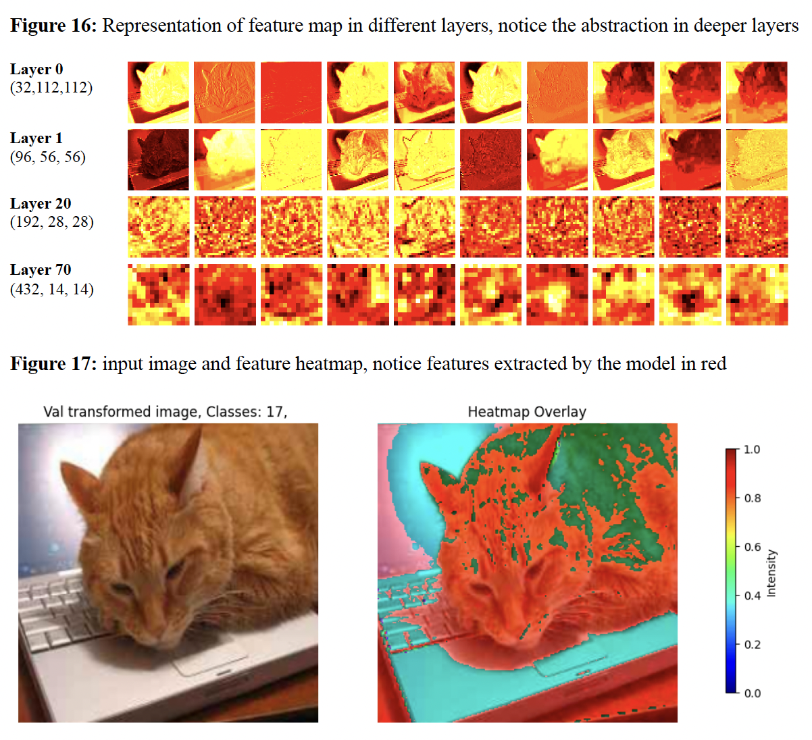
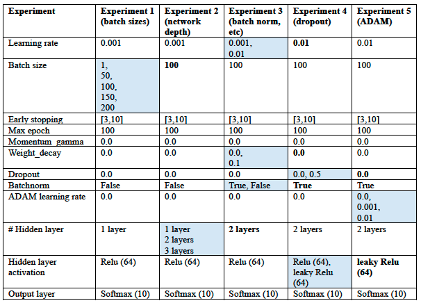
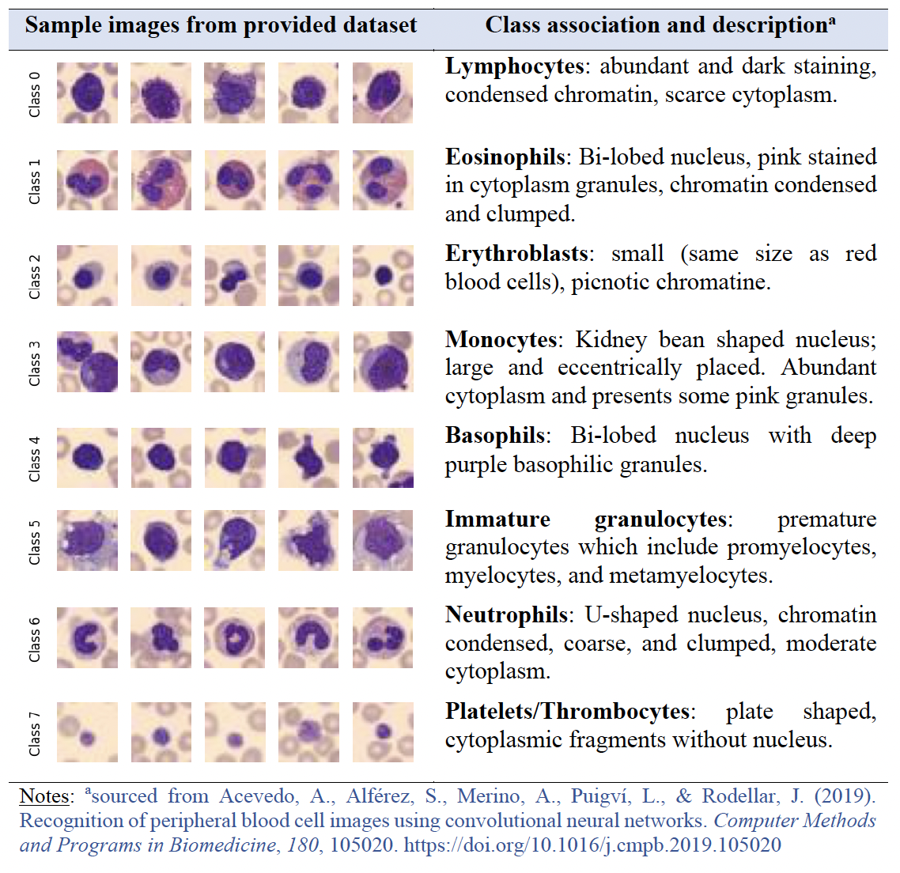
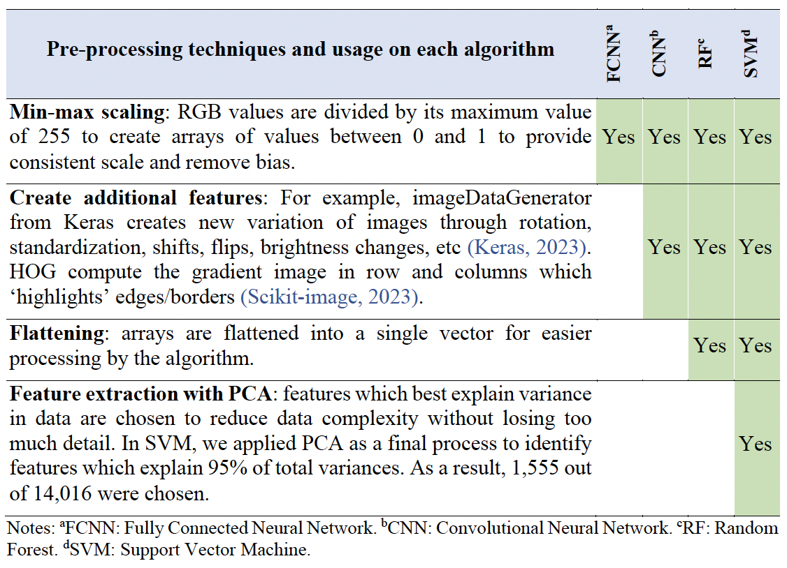
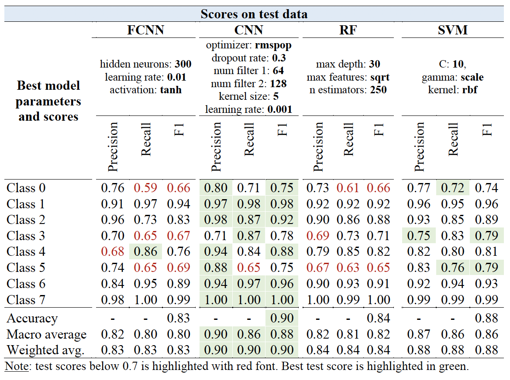
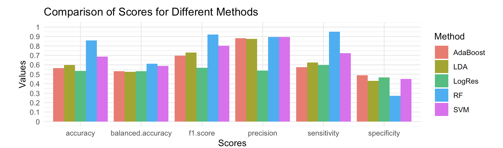
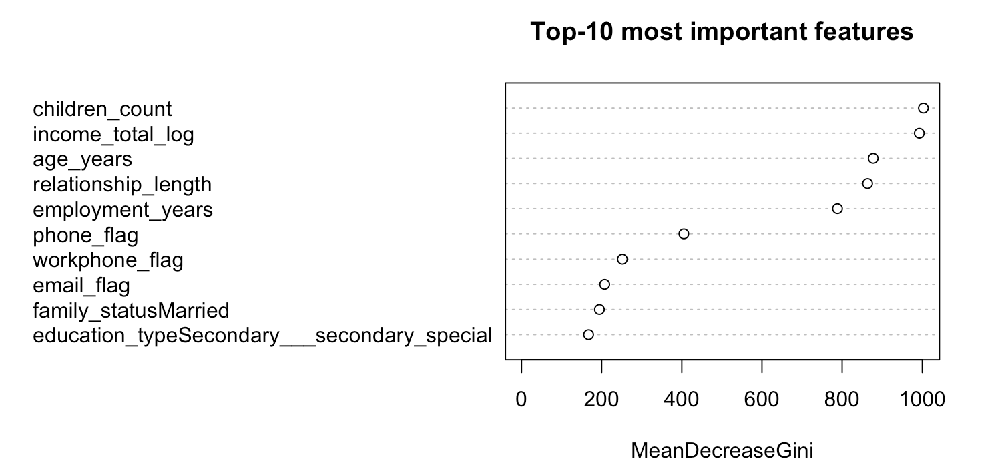

# 🔭 Vincent Yunansan, MBA CFA 

<b>Hi there!</b>
 
 
I'm a former investment banking and private equity professional with over 7 years of experience who has taken the leap into the world of data science. 
I took the Master's in Data Science program at USYD as a career break to explore different problem sets in analytics and machine learning. 
 
   
I am most interested in building repeatable/scalable solutions to process large amounts of data and create simple solutions. 
 

 <b> What I'm working on right now </b>: 
- No-code Exploratory Data Analysis 
- Small object detection system for a drone company
- Template of customizable RAG framework to be fully hosted on GCP

  My latest CV can be accessed here: <a href="assets/Resume_Vincent_Yunansan.pdf"> Curriculum Vitae</a>  

Have any questions? Below is my contact information:
- Email &ensp;&ensp;: vincent.yunansan@gmail.com  
- Phone &ensp;: +61459961345
 

 

# Project Showcase

## No-code EDA platform

 Expand for details

  <i>  This project began on 27 Nov 2024. Repository can be accessed here <a href="https://github.com/vyun8699/monkey_business"> here</a>  </i> 

  <b> Problem </b>: All data science project begins with a proper Exploratory Data Analysis (EDA) which can be repetitive and time consuming. Wouldn't it be nice if there is a tool that allow you to do simply click through, records all changes and output you've made a long the way, and gets you (mostly) there without coding? 
 <b> Solution </b>: This is a work in progress. @ksun5328 and I are building the end-to-end system to deliver this. Stay tuned!   

 

  <video width="320" height="240" controls>
    <source src="assets/EDA_sample.mov" type="video/quicktime">
    Your browser does not support the video tag.
  </video>
   
  WIP view of the no-code EDA platform   
   

## Production optimization for an Australian commodity producer

 Expand for details

  <i> Due to active non-disclosure agreement, details of this project is not made available in this repository. Details provided has been masked to protect confidentiality</i>   
  <b> Problem </b>: This project aims to implement a recommendation system to find combination of batches with highest market prices. The proposed combination has to satisfy 10 different quality metrics. These metrics can be improved by machine processes at a cost of lower output yields. The client has to process c.10,000 batches a year and react to price swings, machine down-time, etc. 
 <b> Solution </b>: Breadth first search (BFS) and Mixed Integer Linear Programming (MILP) were explored. The final optimization method sits somewhere between BFS and MILP by taking out combinations that are too expensive or impossible to produce, search for combinations in the remaining search space, and returns a list of possible batch combinations (without duplicates) in a descending list.   

 <b> Implementation </b>: The solution is hosted on GCP with a Streamlit overlay. This allows site managers to schedule combination reports before they start their day, on-the cloud, with negligible infrastructure cost. Site managers can also produce custom reports when necessary.
 

## Small object detection model for an Australian drone company

 Expand for details

  <i> This is my Capstone Project for the MDS project at USYD. Due to active non-disclosure agreement, details of this project is not made available in this repository. Details provided has been masked to protect confidentiality.</i>   
  <b> Problem </b>: This project aims to implement an automated object detection system able to detect small distant object in outdoor conditions, to be installed on a small computer on-board the vehicle. 
 <b> This project is on-going. The solution can be divided into three branches </b>:   
<ol> 
<li> Custom dataset: built on open-source datasets which has significant sample of small objects of interest. </li>
<li> Optimized model: from multiple computer vision model architectures, including YOLO, Faster RCNN, SSD, and SAM. </li>
<li> Inferencing optimization: we explored the use of SAHI to aid with small object detection in real time. </li> </ol> 

## Multi-class object classification via transfer learning

 Expand for details

  <i> Details of this project can be accessed <a href="https://github.com/vyun8699/CNN-via-transfer-learning"> here</a>  </i> 

  <b> Problem </b>: Training a model from scratch requires massive computational resources not accessible to the common enthusiast. This project showcases methods to access open-source models and fine-tune them to solve a multi-class classification problem.  
 <b> Solution & Implementation </b>:   
<ol> 
<li> Dataset: 30,000 images with 18 classes are split into train and validation sets. </li>
<li> Dataloader: images are loaded in batches to avoid bottlenecking. Transformations applied to increase model robustness. 
<li> Models: pre-trained models from Pytorch are customized to handle multi-class classification. Various methods are applied to aid training speeds and scores. Tableau is used to visualize training statistics.</li>
<li> Performance: micro F1, model size and training runtime are considered together to recommend the best system. </li>
<li> Results: The best model yielded 90%+ test F1 score with 5-hour training run-time. </ol> 

<b> Reflection </b>: computers do not perceive image data as humans do. The images below shows how an image of a cat travels through the layers in RegNet. We can see how the model is able to differentiate features of our object of interest (e.g. the cat) against the surrounding environment. 

  
   
  Sample Feature Map Representation of RegNet

## ♾️ Multi-layer perceptron from scratch

 Expand for details

  <i> Details of this project can be accessed <a href="https://github.com/vyun8699/MLP-from-scratch"> here</a>  </i> 

  <b> Problem </b>: The goal of this project is to implement a neural network without the use of modern machine learning libraries. By doing so, we will showcase the effects of different methods/components to the overall quality of our MLP model on the provided dataset. 
 <b> This project is implemented in Numpy to show how modern machine learning framework ingests data. The system is divided into several steps </b>:   
<ol> 
<li> Pre-processing: input is normalized for better ingestion by the MLP and split into train-validation-test sets. </li>
<li> Base architecture: the MLP is implemented in 3 classes for code hygiene. </li>
<li> Methods: batch training, early stopping, weight decay, dropout, momentum, batch normalization, adam. </li> </ol> 
 

<b> Reflection </b>: I am a firm believer of the iterative process. This project was built in multiple stages where different methods were explored and the best configuration was implemented into the core build. The iterative process is useful in exploring builds efficiently while maintaining explainability. 

  
   
  Experiment stages in the MLP from scratch project.   
   Methods in blue are tested while keeping all else constant.

## Image Classification with BloodMNIST dataset

 Expand for details

  <i> Report and workbook for this project can be accessed <a href="https://github.com/vyun8699/BloodMNIST_classification"> here</a>  </i> 

  <b> Problem </b>: This study compares four machine learning methods in blood cell image classification. The methods are compared by their overall speed, performance scores, and error rates. 

  <b> Dataset </b>: 17,000+ images of blood cells, resized to 28x28 pixels for efficiency. The images are split into 8 classes as shown below:

  
   
  Description of classes in BloodMNIST   
   

  <b> Pre-processing </b>: Different pre-processing steps are applied to each method as appropriate. Please see report for details.

  
   
  Pre-processing steps for each method   
   

  <b> Methods </b>: Different parameters are tuned for each method, including number of neurons, activation function, learning rate, optimizer, regularizer, etc. Please see report for details. 

  <b> Results </b>: Best configuration for each method shown below, along with their class-specific scores. Convolutionary Neural Network (CNN) performs best amongst methods considered. 

  
   
  Tuning results
   

<b> Reflection </b>: Each algorithm has different use cases and trade-offs which should be considered. The choice of algorithm must be matched with the goal of the exercise itself. More complex algorithm may take longer to run and may not provide the best explanation/reasoning on feature importance.  Users need to consider what output needs to be generated to (i) measure the quality of the model, and (ii) provide useful insights when designing a model protocol. Simpler models may provide adequate outputs with lower computational costs (e.g., shorter runtimes) given the right
pre-processing and design.

## Understanding debtor profiles

 Expand for details

  <i> Report for this project can be accessed <a href="https://vyun8699.github.io/"> here</a>  </i> 

  <b> Problem </b>: Understanding relationships between factors in demographic data is equally as important to having access to them in the first place. This project displays how bad debtors can be identified from application data by using different machine learning methods. 
  <b> Side note </b>: This analysis is done on a public dataset hosted on Kaggle. Many submissions on the platform claims 99% accuracy but most of them suffer from data leaks and cross correlation. This happens when the analyst does not do proper data exploration and implemented lines of code onto the problem. 

 <b> This project is implemented in R Studio and follows the following steps </b>:   
<ol> 
<li> Data exploration and pre-processing: cross-correlation and data distribution are analyzed to allow for fair analysis. We removed cross-correlated features and any features that would leak forward-looking information. We applied SMOTE to alleviate data imbalance. </li>
<li> Pre-processing: principal component analysis, min-max scaling, one-hote-encoding, SMOTE. </li>
<li> Classification methods: 5 techniques were applied to find a method with <mark>high True Positives</mark> and <mark> Low False Positives & Negatives </mark></li>
<li> Results: random forest was superior as measured by Precision and Sensitivity. 
</ol> 
 

  
   
 Comparison scores

  
   
Top-10 most important features based on Random Forest

