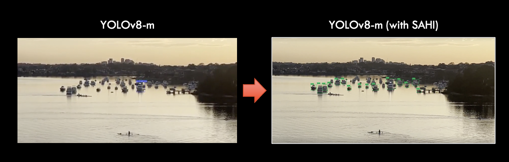

# 🔭 Vincent Yunansan, MBA CFA 

- I'm a former investment banking and private equity professional with over 7 years of experience who has taken the leap into the world of data science.  

- I recently completed the Master of Data Science program at USYD to explore topics of personal interest, such as automation, analytics, language models, and machine learning. 
 
- I am most interested in building repeatable/scalable solutions to process large amounts of data while maintaining simplicity. 

## Curriculum Vitae and Contact Information

- Curriculum Vitae&ensp;: <a href="assets/Resume_Vincent_Yunansan.pdf"> Link</a> 

- Email address&ensp;&ensp;&ensp;&ensp;: vincent.yunansan@gmail.com
 

## Project Showcase - Table of Contents

| Project | Tools and models |
|---------|--------------|
| [Bible Chatbot (RAG model)](#-bible-chat-bot)|    
| [No-code EDA Platform](#-no-code-exploratory-data-analysis-platform) |     |
| [Revenue Optimization with Batching](#-revenue-optimization-for-an-australian-commodity-producer) |      |
| [Small Object Detection for a Drone](#-small-object-detection-model-for-an-australian-drone-company) |             |
| [Multi-class Object Classification](#-multi-class-object-classification-via-transfer-learning) |          |
| [Multi-layer Perceptron from Scratch with Numpy](#-multi-layer-perceptron-from-scratch-with-numpy) |     |
| [Image Classification with BloodMNIST](#-image-classification-with-bloodmnist-dataset) |          |
| [Delinquent Debtor Identification with R](#-delinquent-debtor-identification-with-r) |        |

## [⭐ Bible Chatbot](https://github.com/vyun8699/bible_RAG)
> <b> Web version can be accessed [here](https://biblechats.streamlit.app/).</b>

<b> What is this</b>: This Retrieval-Augmented Generation (RAG) model explores the contents of the KJV holy bible. 
The holy bible is very usable for this exercise as the texts are already naturally chunked by <b>books-chapters-verses</b>. 

<b> What is so cool about it </b>: The chatbot remembers the context of user questions and system answers, allowing the user to ask follow up questions. At each turn, the system gives answers derived from the corpus, along with its supporting verses. 

Build details below:

<ol>
<li> <b> Model</b>: `chat-gpt-4o-mini` via langchain with temperature set to 0.
<li> <b> Corpus</b>: the KJV bible where each verse is a chunk. 
<li> <b> Back-end</b>: Embeddings hosted in a chromadb persistent directory, uploaded onto Github with LFS.
<li> <b> Front-end</b>: Streamlit for quick turnaround.
</ol>

  biblechats in action!  
 

## [⭐ No-code Exploratory Data Analysis Platform](https://github.com/vyun8699/NoCodeEDA)

> <b> Web version can be accessed [here](https://vyun8699.github.io/NoCodeEDA/).</b>
> Please give me a heads up if you are going to use this link as flask server is hosted on the free version of render.com, which switches off after some time of inactivity. 

<b> Problem</b>: All data science project begins with a proper Exploratory Data Analysis (EDA) which can be repetitive and time consuming. Wouldn't it be nice if there is a tool that allow you to do simply click through, records all changes and output you've made a long the way, and gets you (mostly) there without coding?

<b> Solution</b>: I am creating a modular no-code platform to handle pre-processing for CSV files. 
<ol>
  <li> <b>Front-end</b>: ReactJS, hosted on github. Cline for javascript coding support.
  <li> <b>Back-end</b>: Python server with Flask, hosted on render.com (free tier).
</ol>

See some screenshot of current functionalities below:

 <b>(Left)</b> Upload CSV and inspect summary, <b>(Right)</b> Choose relevant parameters 
 
  &nbsp;&nbsp;&nbsp; 

 

 <b>(Left)</b> Create custom visualization, <b>(Right)</b> Transform parameters  
 
  &nbsp;&nbsp;&nbsp; 

 <b>(Left)</b> View correlation and PCA plots, <b>(Right)</b> Check transformation log and save CSV  
 
  &nbsp;&nbsp;&nbsp; 

## ⭐ Revenue optimization for an Australian commodity producer

> <b> ACTIVE NDA - REPOSITORY IS PRIVATE</b>

<b>Problem</b>: This project is done together with a boutique consulting firm for an Australian commodity producer. The client produces c.10,000 tons of raw output per year with 10 different quality metrics measured for individual batches. There are various finished products, each with their own quality requirements and market prices, which swings based on supply-demand.The client does not have a system to identify what product to produce with their existing stock at any given moment, which creates a habit of over-delivering on product requirements. In other words, the raw output used in any given product are often of too high quality, leaving gross margins on the table. 

<b>Solution</b>: Breadth first search (BFS) and Mixed Integer Linear Programming (MILP) were explored. The final optimization algorithm sits somewhere between BFS and MILP by reducing the search space up-front and returning a descending list of possible batch combinations based on their potential gross margin. 

<b> Impact </b>: A$15m of additional gross margins for a full year identified.  The solution will be hosted on GCP with a Streamlit overlay. This allows site managers to schedule combination reports before they start their day, on-the cloud, with negligible infrastructure cost. Site managers can also produce custom reports when necessary.

## ⭐ Small object detection model for an Australian drone company

><b> ACTIVE NDA - REPOSITORY IS PRIVATE</b>

<b>Problem</b>: This project aims to implement an automated object detection system to detect small & distant object in the horizon. The model will be ran locally on the small computer on-board the drone. The system is expected to function in all weather conditions, given enough natural light. 

<b> Solution</b> can be divided into three main parts: 
<ol> 
<li><b>Custom dataset</b>: built on several open-source datasets, controlled for object size distribution, annotation quality, image resolution, and diversity of weather/lighting condition.
<li> <b>Optimized model</b>: Several model architectures were fine-tuned (YOLOv8, YOLOv9, Faster RCNN, SSD, and SAM). Hyperparameter tuning done on YOLOv8-n/s/m. 
<li> <b>Slicing Aided Hyper Inferencing (SAHI)</b>: Implemented at inferencing to further aid the models accuracy in detecting small objects. 
</ol>

<b>Impact</b>: SAHI was particularly helpful with achieving the project objective. Learning from this project is used by the client in their on-board object detection system.

  Detection of small objects on YOLOV8-m <b>(Left)</b> without SAHI and <b>(Right)</b> with SAHI  
  

Small object detection with SAHI  
 

## [⭐ Multi-class object classification via transfer learning](https://github.com/vyun8699/CNN-via-transfer-learning)

><b> TABLEAU DASHBOARD CAN BE ACCESSED <a href="https://public.tableau.com/app/profile/vincent.yunansan/viz/log_analyzer/Dashboard3?publish=yes">[HERE]</a> </b> 

<b> Problem</b>: This project aims at fine-tuning open-source models to solve a multi-class classification problem. Training dataset consists of 30,000 images with 18 classes. 

<b> Solution</b>: Multiple pre-trained models from Pytorch were used. Softmax layer was adjusted to account for the multi-class classification task. Training done in batches and noise introduced with Dataloaders.  

<b>Impact</b>: The resulting model yielded 90%+ test F1 score with 5-hour traning runtime.

   
  Sample Feature Map Representation of RegNet  
  
  

## [⭐ Multi-layer perceptron from scratch with Numpy](https://github.com/vyun8699/MLP-from-scratch)

<b> Problem</b>: Machine learning libraries often pack multiple mechanisms into a single function, which makes it hard to discern what happens underneath. 

<b> Solution</b>: This project uses Numpy to create a Multi Layer Perceptron (MLP) model. The system is split into three classes: 
<ol> 
<li> <b>Activation</b>: ReLu, Sigmoid, Tanh and their derivatives. </li>
<li> <b>Hidden Layer</b>: weights & biases, transformations such as batch normalization, momentum, dropout, weight decay, etc. </li>
<li> <b>Model</b>: batch training, loss functions, etfc. </li> </ol> 

Multiple parameters were tested against the training dataset. 
Summary below: 

  <b> (Left to Right) </b> Experiment stages 
  <b> (Highlight) </b> Parameters in hyperparameter tuning  
  

## [⭐ Image Classification with BloodMNIST dataset](https://github.com/vyun8699/BloodMNIST_classification)

<b> Problem </b>: This study compares FCNN, CNN, Random Forest, and Support Vector Machine for blood cell image classification. The dataset used contain 17,000+ images of blood cells, resized to 28x28 pixels. The images are split into 8 classes as shown below:

  Description of classes in BloodMNIST    
  

<b> Results </b>: 
<ol>
<li>Pre-processing was applied to each model as appropriate. 
<li>Hyperparameter tuning was done on number of neurons, activation function, learning rate, optimizer, regularizer, etc.  
<li> CNN was identified as best model. Please see report for details.
</ol>

 

<b>(Left)</b> Pre-processing, <b>(Right)</b> Results  
 
  &nbsp;&nbsp;&nbsp;

## [⭐ Delinquent Debtor Identification with R](https://vyun8699.github.io/)

<b> Problem </b>: This project identifies potential delinquent debtors based on their features in their initial debt application.

 <b>Solution</b>: This project was implemented in R. 
 <ol>
 <li> The following features were removed: features with cross-correlation, redundant features, forward-looking features. 
 <li>SMOTE was applied to improve data balance. 
<li> Pre-processing: principal component analysis, min-max scaling, one-hot-encoding. 
<li> Classification methods: 5 techniques were applied to find a method with <b> high True Positives</b> and <b> Low False Positives & Negatives </b></li>
</ol> 

<b>Results</b>: random forest was superior as measured by precision and sensitivity. Top-10 most important features identified by Random Forest shown below:
 

 

<b>(Left)</b> Comparison scores, <b>(Right)</b> Top-10 most important features  
 
  &nbsp;&nbsp;&nbsp;

